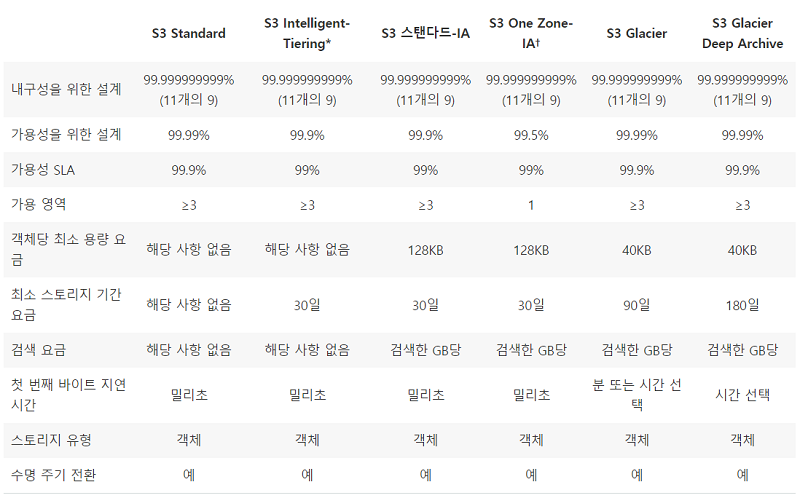

# AWS Certified Cloud Practitioner 2020

21-03-17 ~ 

## [Chapter1. 소개(Introduction)](./Chapter1.md)

기본적인 AWS Certified Cloud Practitioner 의 소개 영상입니다.

## [Chapter2. 클라우드 개념과 기술(Cloud Concepts and Technology)](./Chapter2.md)

클라우드 개념(26%)과 기술(33%)을 요약했습니다.

## [Chapter3. 가격과 책정(Billing & Pricing)](./Chapter3.md)

가격과 책정(16%)을 요약했습니다.

## [Chapter4. 클라우드 보안(Security In The Cloud)](./Chapter4.md)

클라우드 보안(25%)을 요약했습니다.

## 강의에서 나오는 팁(예상 문제)들

### 2-1-tips. 클라우드 컴퓨팅이란?(What Is Cloud Computing?)

- Know the 6 Advantages of Cloud
  - Trade Capital Expense For Variable Expense
  - Benefit from massive economies of scale
  - Stop guessing about capacity
  - Increase speed and agility
  - Stop spending money running and maintaining data centers
  - Go global in minutes
- Know 3 different types of Cloud Computing
  - Infrastructure As A Service(IAAS): EC2
  - Platform As A Service(PAAS): Elatic Beanstalk, Lightsail
  - Software As A Service(SAAS): Gmail
- Know 3 types of Cloud Computing Deployments
  - Public Cloud: AWS, Azure, GCP
  - Hybrid: Mixture of public and private
  - Private Cloud(Or on Premise): You manage it, in your datacenter. Openstack or Vmware

### 2-2-tips. AWS와 세계 둘러보기(Around THe World With AWS)

- Understanding the difference between a Region, an Availability Zones(AZ) and an Edge Location
  - A Region is a physical location in the world which consists of two or more Availability Zones(AZ's).
  - An AZ is one or more discrete data centers, each with redundant power, networking and connectivity, housed in separate facilities.
  - Edge Locations are endpoints for AWS which are used for caching content. Typically this consists of CloudFront, Amazon's CDN.
- Choosing the right AWS Region?
  - Data Sovereignty Laws
  - Latency to end users
  - AWS Services

### 2-3-tips. AWS 로그인 하기(Let's Log In To AWS)

- Understand the difference support packages
  - Basic: Free
  - Developer: $29 a month(scales based on usage)
  - Business: $100 a month(scales based on usage)
  - Enterprise: $15,000 a month(scales based on usage)

### 2-7-tips. [LAB: Cloud 시작하기! IAM(Identity Access Management)]

- IAM
  - IAM stands for **Identity Access Management**.
  - It's **Global**, you do not specify a region when dealing with IAM.
  - When you create a user or group, this is created GLOBALLY

- You can access the AWS platform in 3 ways
  - Via the Console
  - Programatically(Using the Command Line)
  - Using the Software Developers Kit(SDK)

- root account
  - Your root account is the email address you used to set up your AWS account.
  - The root account always has full administrator access.
  - You should not give these account credentials away to anyone.
  - Instead create a user for each individual within your organization.
  - You should always secure this root account using multi-factor authentication.

- group
  - A group is simply a place to store your users.  
  - Your users will inherit all permissions that the group has.  
  - Examples of groups might be developers, system administrators, human resources, finance etc.  

- policies
  - To set the permissions in a group you need to apply a policy to that group.
  - Policies consist of JSON.
  - These are referred to as key value pairs.
  - You have your key, such as name and then the value eg.

### 2-9-tips. IAM 자격 증명 기록(IAM Credential Reports)

- You can generate and download a **credential repor**t that lists all users in your account.
  - Passwords
  - Access Keys
  - MFA

### 2-11-tips. S3 101

- S3
  - S3 is **Object-based**: i.e. allows you to upload files.
  - Files can be from 0 ~ 5 TB.
  - There is unlimited storage.
  - Files are stored in Buckets.
  - S3 is a universal namespace. That is, names must be unique globally.
  - Not suitable to install an operating system on.
  - Successful uploads will generate a HTTP 200 status code.

- The Key Fundamentals of S3 Are
  - Key(This is simply the name of the object)
  - Value(This is simply the data and is made up of a sequence of bytes)
  - Read after Write consistency for PUTS of new Objects
  - Eventual Consistency for overwrite PUTS and DELETES(can take some time to propagate)

- 7 different storage classes
  - S3 Standard 
  - S3 IA
  - S3 One Zone - IA
  - S3 Intelligent Tiering
  - S3 Glacier
  - S3 Glacier Deep Archive
  - S3 Outposts

### 2-12-tips. [LAB: S3 버킷 만들기(Let's Create An S3 Bucket!)]

- Bucket
  - Bucket names share **a common name space**. You can't have the same bucket name as someone else.
  - When you view your buckets you biew them **globally** but you can have buckets in **individual regions**.
  - You can replicate the contents of one bucket to another bucket automatically by using **cross region replication**.

- Restricting Bucket Access
  - Bucket Policies - Applies across the whole bucket
  - Object Policies - Applies to individual files
  - IAM Policies to Users & Groups - Applies to Users & Groups

### 2-13-tips. [LAB: S3에서 WebSite 만들기(Let's Create A Website On S3)]

- bucket
  - You can use bucket polices to make entire S3 buckets public.
  - You can use S3 to host STATIC websites(such as .html). Websites that require database connections such as Wordpress etc cannot be hosted on S3.
  - S3 Scales automatically to meet your demand. Many enterprises will put static websites on S3 when they think there is going to be a large number of requests(such as for a movie preview for example).

