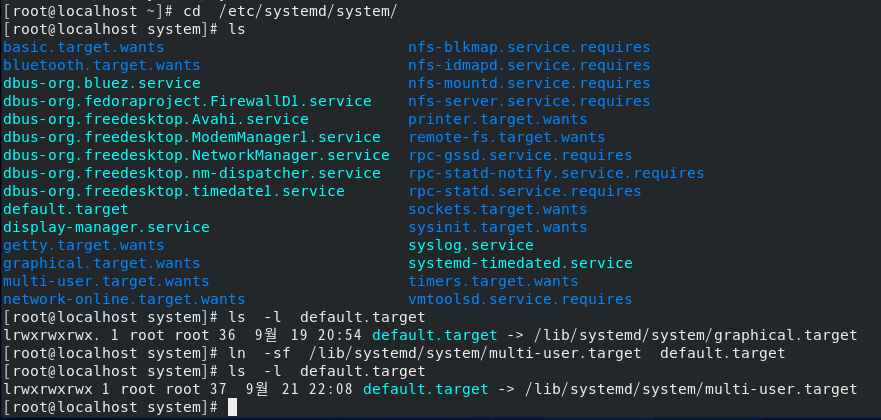

## 04-01 필수개념과 명령어-시작과 종료, 가상콘솔, 런레벨, 자동완성

### 복습

Server RAM -> 2GB  
Client RAM -> 1.5GB  

로 수정시 원활히 진행 가능

### 시작과 종료

- 종료: ```shutdown -P now```, ```halt  -p```, ```init 0```
- 5분뒤 종료: ```shutdown -h +5```
- 종료 메시지 날리기: ```shutdown -k +5```
- 종료 취소: ```shutdown -c```
- 재부팅: ```shutdown -r now```, ```reboot```, ```init 6```
- 로그아웃: ```logout```, ```exit```

### 가상 콘솔

가상의 모니터, CentOS는 총 5~6개 가상 콘솔을 제공

단축키 ```Ctrl``` + ```Alt``` + ```F2``` ~ ```F6```

[실습1] 여러명의 사용자가 동시 접속

### Runlevel

Rnulevel 이란 init 명령어 뒤에 붙는 숫자를 말함

- 0: Power Off: 종료
- 1: Rescue: 시스템 복구 모드, 단일 사용자 모드
- 2: Multi-User: 사용 안함
- 3: Multi-User: 텍스트 모드, 다중 사용자 모드
- 4: Multi-User: 사용 안함
- 5: Graphical: 그래픽 모드, 다중 사용자 모드
- 6: Reboot: 다시시작

Runlevel 모드 확인: ```ls  /lib/systemd/system/runlevel?.target```


[실습2] 시스템의 현재 설정된 Runlevel을 확인하고 변경해보자

1. 현재 설정된 Runlevel 확인
   1. 해당 폴더로 들어감: ```cd  /etc/systemd/system```
   2. 해당 폴더의 파일 확인: ```ls``` -> ```default.target ``` 찾기
   3. default.target이 무엇을 가르키는지 확인: ```ls -l default.target```
2. Default.target 변경하기
   1. ```ln  -sf  /lib/systemd/system/multi-user.target  default.target```
   2. ```ls  -l  default.target``` 로 확인
   3. ```reboot``` 로 재시작
   4. 리부트 후에 계정 로그인 후 ```stratx``` 명령어로 xwindow 모드로 열 수 있음
   5. 다시 돌리고 싶으면 위에 ```cd  /etc/systemd/system```들어간 후
   6. ```ln  -sf  /lib/systemd/system/graphical.target  default.target``` 으로 변경

[실습2 결과]



### 자동 완성과 히스토리

자동완성은 ```Tab``` 과 ```방향키```로 볼 수 있습니다. 정확성과 효율성이 올라갑니다.

정확성을 위해서 자동완성을 추천합니다.

히스토리 보기: ```history```
히스토리 삭제하기: ```history  -c``` 