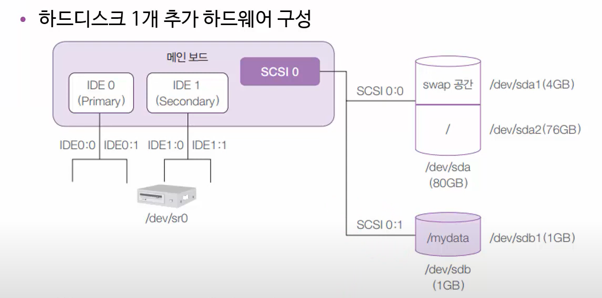
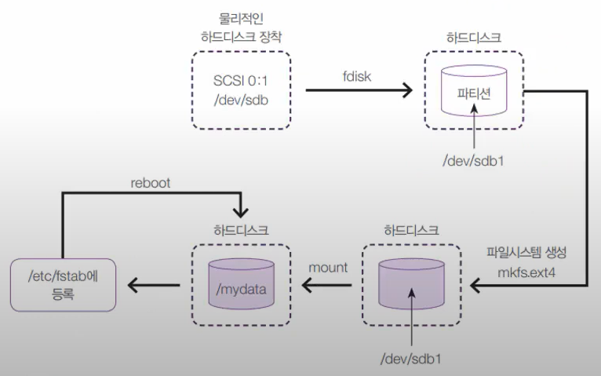
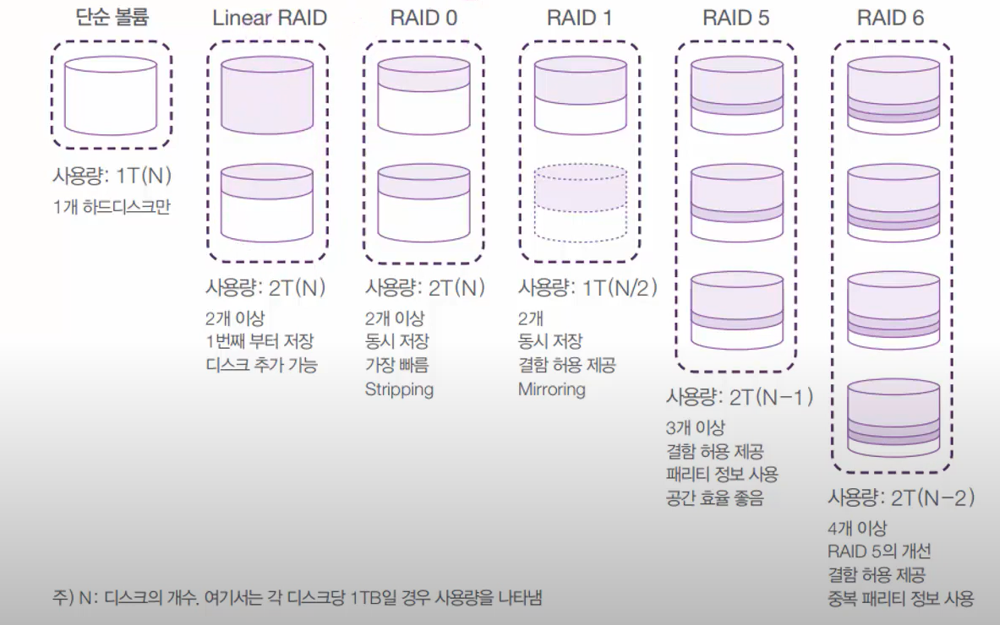

# Chapter06 Summary 하드디스크 관리

## 06-01 IDE 및 SCSI 장치 개념, 하드디스크 1개 추가

### 하드디스크 연결 방식에 따른 분류

1. IDE(Intergrated Drive Electronics)
   - PATA(Parallel Advanced Tachnology Attachment) 라고도 불림
   - 병렬로 데이터를 전송
   - 옛날 규격
2. SATA(Serial Advanced Technology Attachment)
3. SCSI(Small Computer System Interface)
4. SAS(Serial Attached SCSI)
5. HDD -> SSD(Solid State Drive(Disk))

### IDE 장치와 SCSI 장치의 구성


- IDE는 옛날 방식으로 2개씩 장착 할 수 있음
- 요즘은 SATA 방식으로 장착
- SCSI 하드를 사용한다면
  - SCSI 는 4개를 사용하고
  - 0 ~ 15 까지 16개 중에 7번은 예약이 되어 있어 15개를 사용 가능
  - 4 * 15개 60개를 사용할 수 있음
- 하드 디스크를 물리적으로는 `/dev/sda`, `/dev/sdb`, `/dev/sdc` ... 로 부름
- 디스크 파티션이 나눠진 것을 논리적으로는 `/dev/sda1`, `/dev/sda2`, `/dev/sda3`,` /dv/sdb1`, `/dev/sdb2` ... 로 부름



- 장착된 디스크의 이름은 /dev/sdb
- 논리적인 파티션의 이름은 /dev/sdb1
- 파티션을 그냥 사용할 수 없으며 반드시 특정한 디렉토리에 마운트 시켜야 함

### [실습1] 하드디스크 1개 장착

개념도



1. 물리적인 하드디스크 장착하기
   - `Add` -> `SCSI` -> `New` -> `1GB`, `Single` -> `Finish`
2. root로 로그인 후 -> Terminal
   ```bash
   fdisk
   ls -l /dev/sd*
   fdisk /dev/sdb  # 하드디스크 들어가기
   m  # 도움말
   n  # new (파티션 만들기)
   # p 주 파티션
   # e 확장 파티션
   p  # primary 파티션 만들기
   p  # default
   1  # default
   `enter`  # 처음부터 끝까지 잡기
   `enter`  # 처음부터 끝까지 잡기
   p  # print info
   w  # write
   ```
3. format 하기, mount 하기
   ```bash
   mkfs.ext4 /dev/sdb1
   
   mkdir /mydata  # scsi0:0 /dev/sdb1 으로 연결할 폴더 생성
   # 사실 현재 /dev/sda2에 연결한거나 마찬가지
   mount /dev/sdb1 /mydata/  # 연결
   mount
   cp anaconda~ /mydata/test1  # 아나콘다 파일을 scsi0:1로 보냄
   # 사실 scsi0:1은 scsi0:0의 /dev/sda2로 연결되어 있는 상태
   umount /dev/sdb1
   ls -l /mydata  # umount 한 상태이기 때문에 데이터가 없음
   ```
 

## 06-02 하드디스크 관리-RAID 개념1(Linear, RAID0, RAID1)
## 06-03 하드디스크 관리-RAID 개념2(RAID5, RAID6, RAID 10)

### RAID 정의 및 개념

RAID 정의
- RAID: Redundant Array of Inexpensive Disks
- 여러 개의 디스크를 하나의 디스크처럼 사용함
- 비용 절감 + 신뢰성 향상 + 성능 향상의 효과를 냄

Hardware RAID
- 하드웨어 제조업체에서 여러 개의 하드디스크를 가지고 장지를 만들어서 그 자체를 공급
- 좀 더 안정적이지만 비쌈

Software RAID
- 고가의 하드웨어 RAID의 대안
- 운영체제에서 지원하는 방식
- 저렴한 비용으로 좀 더 안전한 데이터의 저장이 가능
- 우리가 공부하는 것은 software RAID 임

### RAID 기술

- Striping: Share data
- Mirroring: Copy data
- Parity: Check error

### RAID 방식의 비교

|                      | Linear RAID | RAID 0 | RAID 1       | RAID 5               | RIAD 6            | RAID 1+0                     |
| -------------------- | ----------- | ------ | ------------ | -------------------- | ----------------- | ---------------------------- |
| Minimum Drives       | 2           | 2      | 2            | 3                    | 4                 | 4                            |
| READ Performance     | -           | High   | High         | High                 | High              | High                         |
| WRITE Performance    | -           | High   | Medium       | Low                  | Low               | Medium                       |
| Capactiy Utilization | 100%        | 100%   | 50%          | 67 ~ 94%             | 50% ~ 88%         | 50%                          |
| Data Protection      | NO          | NO     | Single-drive | Single-drive faliure | Two-drive faliure | Up to 1 disk in each sub array |

### Linear RAID

- 갯수: 2개 이상
- 방식: 앞 디스크부터 차례로 저장
- 효율성: 100% 공간 효율성
- 신뢰성: 보통
- 특징: 2개 이상의 하드디스크를 1개의 볼륨으로 사용

### RAID 0

- 갯수: 2개 이상
- 방식: 모든 디스크에 동시에 저장됨
- 효율성: 100% 공강효율성
- 신뢰성: 낮음
- 특징: 빠른 성능, 하나만 고장나더라도 모두가 고장

### RAID 1

- 하드디스크 갯수: 2개 이상
- 방식: 미러링(Mirroring)
- 신뢰성: 높음
- 공간 효율성: 50%
- 특징: 결함 허용(Fault tolerance)

### RAID 5

- 갯수: 3개 이상
- 방식: RAID 1의 안정성 + RAID 0의 공간 효율성 + Parity
- 효율성: 디스크 갯수 - 1
- 신뢰성: 약간 높음
- 특징: 오류 발생시 Parity bit로 오류 복구, 2개 이상 고장시 복구 못함

### RAID 6

- 갯수: 3개 이상
- 방식: RAID 5 개선, 2개의 Parity
- 효율성: 디스크 갯수 - 2
- 신뢰성: 약간 높음
- 특징: 오류 발생시 Parity bit로 오류 복구, 3개 이상 고장시 복구 못함
- 속도: RAID 5 보다 약간 떨어짐
 
### RAID 1+0

RAID 1 + RAID 0 한 것으로 신뢰성과 성능이 동시에 뛰어남



### RAID 표 참고

