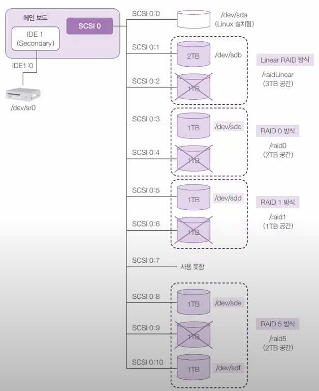

## 06-07 하드디스크 관리-Linear RAID, RAID 0, 1, 5 문제 발생과 조치방법

- Linear RAID, RAID0 은 '결함 허용' 기능이 없음
- RAID1, RAID5는 '결함 허용' 기능이 있음

### [실습7] RAID의 하드디스크 고장

실습 목표: Linear RAID, RAID 0, 1, 5의 하드디스크가 고장 난 상황을 본다.

고장나면 /dev/sd **`알파벳`** 이 새로 부여된다.(실습 구성도 참고)

실습 구성도



1. Terminal에서
   ```bash
   df  # 드라이브 확인하기
   # 파일 아무거나 복사해서 드라이브에 넣기
   cp /boot/vmlinuz-4* /raidLinear/testFile
   cp /boot/vmlinuz-4* /raid0/testFile
   cp /boot/vmlinuz-4* /raid1/testFile
   cp /boot/vmlinuz-4* /raid5/testFile
   # 컴퓨터 끄기
   halt -p
   ```
2. 연결된 드라이브 빼기
   - `SCSI0:2`, `SCSI0:4`, `SCSI0:6`, `SCSI0:9` `Remove` 하기

3. 컴퓨터 다시 켜기
   - 컴퓨터를 다시 키면 `응급모드`로 들어가진다.
   - root 의 비밀번호를 치고
   ```bash
   ls -l /dev/sd*  # 드라이브 목록 보기
   df
   ls -l /raid1 /raid5  # 안에 파일이 살아있는지 확인
   mdadm --detail /dev/md1  # 상세히 보기
   mdadm --detail /dev/md5  # 상세히 보기
   mdadm --run /dev/md9  # fail(작동 자체가 불가)
   mdadm --run /dev/md0  # fail(작동 자체가 불가)
   mdadm --stop /dev/md9  # Linear LAID 중단
   mdadm --stop /dev/md0  # LAID0 중단
   vi /etc/fstab
        /raid0, /raidLinear 주석 처리
   reboot  # 재시작
   ```

4. 컴퓨터 재시작 후
   - 정상 부팅 가능
   ```bash
   df
   ls -l /raid1  # 안에 파일이 살아있는지 확인
   ls -l /raid5  # 안에 파일이 살아있는지 확인
   ```
