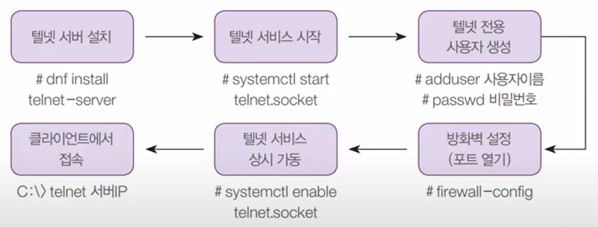

## 08-01 원격지 시스템 관리-텔넷 서버

### 텔넷 서버 개요

- 오랫동안 전통적으로 사용된 원격 접속 방법
- 보안 취약
- 리눅스 서버 -> 텔넷 서버 설치
- 리눅스 클라이언트 -> 텔넷 클라이언트 프로그램 필요
- 원격지의 PC에서 접속하면 서버 앞에 앉아서 텍스트 모드로 작업하는 것과 동일한 효과

- 텔넷 서버 설치 과정

 
### [실습1] 텔넷 서버 설치

실습목표
- 리눅스 텔넷 서버 설치 가동, 원격지의 Windows에서 접속해 리눅스 관리하기
- 기본적인 서버 구축 방법을 익힘

1. 텔넷 서버 설치 후 서버에서 접속 가능한지 확인 후 방화벽 포트 열기
    ``` bash
    $ dnf -y install telnet-server
    $ systemctl restart telnet.socket
    $ systemctl status telnet.socket
    $ adduser teluser
    $ passwd teluser
    $ telnet 192.168.111.100  # telnet 서버로 접속하기
    firewall-config  # 방화벽 포트 열기
    ```

    `영구적`으로 설정 -> public에 내리다 보면 `telnet` 체크 -> 상단에 `옵션` -> `Firewalld 다시 불러오기`

2. Windows 클라이언트로 들어가서 telnet 클라이언트를 설치하기

    `Windows` -> `앱 및 기능` -> `프로그램 및 기능`(`window` + `R` -> `appwiz.cpl`) -> `Windows 기능 켜기/끄기` -> `Telnet Client` 켜기 -> `다 시 시작`

3. Windows terminal에서
    ``` powershell
    ping 192.168.111.100  # 네트워크 확인
    telnet 192.168.111.100  # 네트워크 접속 확인
    ```

4. Server에서
    ``` bash
    systemctl enable telnet.socket  # 컴퓨터를 켜놓으면 자동으로 텔넷 운영 가능
    ```
