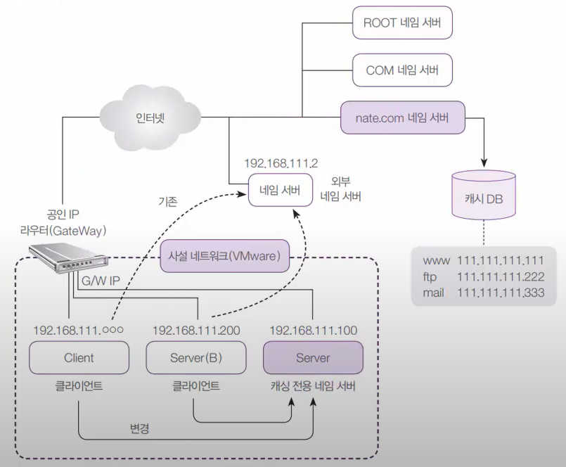

## 09-02 네임 서버-IP획득과정, DNS개념, 캐싱전용네임서버 구축

### IP 주소를 얻는 내부 흐름


### 도메인 이름 체계

- 초창기 인터넷에는 1대의 네임 서버만으로 충분
- 인터넷이 많아짐으로 몇 대의 네임 서버로 실시간으로 인터넷 상의 수많은 컴퓨터 관리를 하기 힘듬
- 그래서 트리 구조와 같은 도메인 이름 체계를 고안
    - Root(.)도메인 -> net, com, org, edu, kr, fr, sp ...
    - kr -> co, or ...
    - co -> samsung, lg ...

### 로컬 네임 서버가 작동하는 순서


### 캐싱 전용 네임 서버

- PC에서 URL로 IP주소를 얻고자 할 때, 해당 URL의 IP 주소를 알려주는 네임 서버



### [실습2] 캐싱 전용 네임 서버 구축

실습목표
- Server 가상머신을 캐싱 전용 네임 서버로 만듬
- 네임서버와관련된 패키지를 설치, 설정파일을 수정

1. 캐싱 전용 네임 서버 구축하기

    ```bash
    $ dnf -y install bind-chroot  # 네임 서버 관련 패키지 설치
    $ vi /etc/named.conf
        :set nu  # 행번호 보기
        11행(listen-on): 127.0.0.1; -> any;
        12행(listen-on-v6): ::1; -> none;
        19행(allow-query): localhost; -> any;
        34행(dnssec-validation): yes; -> no;
        :wq
    systemctl restart named  # 재시작
    systemctl enable named  # 활성화
    systemctl status named  # 작동 확인
    firewall-config  # 방화벽
    ```
    `영구적` -> `dns` 체크 -> 상단에 `옵션` -> firewalld 다시 불러오기

    ``` bash
    $ dig @192.168.111.100 www.nate.com  # 서버 내부에서 테스트 하기
    $ nslookup
        > server  # 192.168.111.2 로 설정되어 있음
        > server 192.168.111.100  # 192.168.111.100 로 바꾸기
        > www.nate.com
    ```

2. 리눅스 클라이언트에서 DNS 주소 설정하기

    ```bash
    $ nslookup
        > server
        > exit
    whoami
    su -c 'gedit /etc/resolv.conf'
        nameserver 192.168.111.100
    $ nslookup
        > server  # 변경사항 확인    
    ```

3. 서버B에서 DNS 주소 설정하기

    ``` bash
    $ vi /etc/resolv.conf
        nameserver 192.168.111.100
    $ nslookup
        > server
        > www.nate.com
    $ dnf -y install elinks  # 텍스트로 웹브라우저 보기
    $ elinks
        www.kernel.org  # 웹브라우저 사용 가능  
    ```

4. 윈도우 클라이언트에서 DNS 주소 설정하기

    제어판 -> 네트워크 상태 및 공유 센터 -> `Ethernet0` -> `속성` -> `IPv4` -> `속성` -> 다음 DNS 서버 주소 사용 -> `192.168.111.100` -> `확인`

    DNS 초기화하기

    powershell 관리자권한으로 실행
    ```powershell
    ipconfig
    netsh interface ip set dns "Ethernet0" dhcp  # dhcp로 바꾸기
    ```
