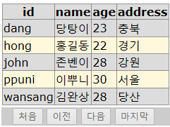

## 11-05 데이터베이스 서버-Visual Studio와 MariaDB 연동

### [실습4] Visual Studio와 MariaDB 연동

실습목표
- Windows의 Visual Studio와 리눅스 MariaDB를 연동하는 방법을 확인
- 무료 프로그램인 Visual Studio 2015의 기본적 사용법을 익힘
- ODBC 설정 방법을 알아봄

구성도
- 웹(외부 PC) <-> Window(비주얼 스튜디오 <-> ODBC) <-> Linux(MariaDB <-> DB)

Windows 클라이언트에서

Visual Studio 2015 다운로드 링크 -> [http://download.hanbit.co.kr/centos/8/ko_visual_studio_community_2015_with_update_3.exe](http://download.hanbit.co.kr/centos/8/ko_visual_studio_community_2015_with_update_3.exe)

    사용자 지정 설치 -> Web Developer Tool 만 다운로드(오래 걸림 15분 이상)

MySQL Connetor ODBC(8.0.22) 다운로드 링크 -> [https://dev.mysql.com/get/Downloads/Connector-ODBC/8.0/mysql-connector-odbc-8.0.22-win32.msi](https://dev.mysql.com/get/Downloads/Connector-ODBC/8.0/mysql-connector-odbc-8.0.22-win32.msi)

    설치 후 -> 시작 검색에 ODBC 데이터 원본 -> 시스템 DSN 클릭 -> 추가 -> MySQL ODBC Unicode Driver -> 이름: Maria ODBC -> TCP서버: 192.168.111.100, 사용자: winuser, 비밀번호: 4321, DB: shopping_db -> OK

비주얼 스튜디오에서

    파일 -> 새로만들기 -> 웹 사이트 -> ASP.NET 빈 웹 사이트 -> 확인 

    오른쪽 사이드에 솔루션 탐색기 -> 웹사이트 오른쪽 클릭 -> 추가 -> 웹 폼 -> 확인

    웹 폼은 사용자가 사용할 수 있는 간단한 GUI 화면, 왼쪽 아래 디자인 클릭 ->

    도구상자 -> 데이터 -> 
    
    SqlDataSource(DB연결) -> '>' 클릭 후 데이터 소스 구성 -> 새 연결 -> Microsoft ODBC 데이터 소스 -> 사용자 또는 시스템 데이터 소스 이름 사용에 MariaODBC -> 로그인 정보 -> winuser, 비밀번호: 4321 -> 연결 테스트 -> 다음 -> 사용자 지정 SQL 또는 저장 프로시저 지정 -> SQL 문 SELECT * FROM customer -> 쿼리 테스트 -> 다음 -> 마침

    도구상자 -> 데이터 -> 

    ListView -> 데이터 소스 구성 -> SqlDataSource1 -> ListView 구성 -> 표, 전문가, 페이징 사용 -> 확인

    파일 -> 모두 저장, 파일 -> 브라우저에서 보기

