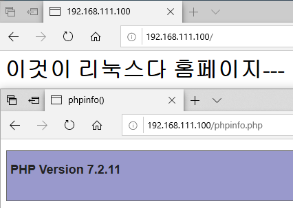

## 12-01 웹 서버-dnf로 APM 설치

### APM 개요

- 리눅스를 가장 많이 활용하는 분야가 웹 서버
- 가장 안정적이고 유명한 Apache 웹 서버 
- APM = Apache 웹 서버 + 프로그래밍 언어 PHP + 데이터베이스 MariaDB
- 리눅스 환경에서 사용될 경우 LAPM(Linux, Apache, PHP, MariaDB)이라고도 부름
- APM이라는 소프트웨어는 존재하지 않으며 이 3가지가 서로 잘 연동되어 운영되도록 - 만든 환경을 APM이라고 부르는 것임
- CentOS는 DNF 명령으로 편리한 설치를 제공

### [실습1] dnf로 웹 서버 설치

실습목표
- 간단하게 dnf 명령으로 웹 서버를 설치
- 추가할 패키지 httpd php php-mysqlnd mariadb-server을 설치

서버 초기화 후 터미널에서

```bash
$ rpm -qa httpd php mariadb-server  # 설치 확인하기
$ dnf -y install httpd php php-mysqlnd mariadb-server  # 설치
$ rpm -qa httpd php mariadb-server  # 버전 확인하기
$ systemctl restart httpd
$ systemctl enable httpd
$ systemctl status httpd
$ systemctl restart mariadb
$ systemctl enable mariadb
$ systemctl status mariadb
# php는 서비스가 아니라 아파치에 포함된 기능이기 때문에 별도로 작동할게 없음
# amp 중에서 아파치와 마리아디비 마이에스큐엘만 작동시키면됨

# 웹 서버의 홈페이지 만들기
$ cd /var/www/html  # 웹 서버
$ nano index.html
> <h1>이것이 리눅스다 홈페이지---</h1>
# Ctrl+X, Y, Enter
```

웹에서 -> `localhost` 로 들어가서 잘 되는지 확인

```bash
$ nano phpinfo.php
> <?php phpinfo(); ?>
# Ctrl+X, Y, Enter
```

웹에서 -> `localhost/phpinfo.php` 로 들어가서 잘 되는지 확인, apm이 잘 작동

```bash
$ firewall-config  # 웹 서버 포트(http, https) 열기
$ firewall-cmd --permanent --add-service=http
$ firewall-cmd --permanent --add-service=https
$ firewall-cmd --reload
```

윈도우 클라이언트에서

- `192.168.111.100`으로 들어가서 잘 되는지 확인
- `192.168.111.100/phpinfo.php` 잘 되는지 확인


