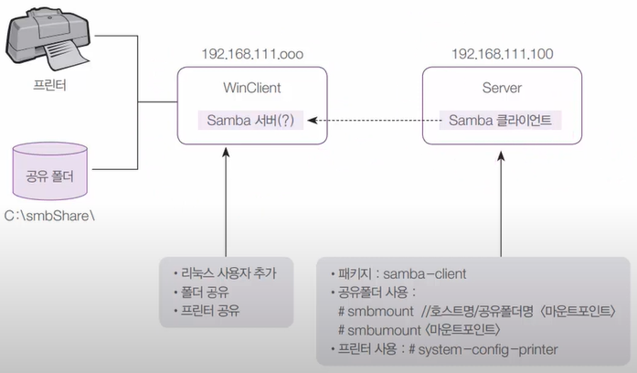

## 15-01 Samba 서버-리눅스에서 Windows 폴더 사용

### Samba 서버 소개

- 예전에는 Windows와 Linux/Unix 사이에 프린터나 폴더 등의 자원 공유가 어려웠음
- Samba 서버는 Windows와 Linux/Unix 사이에서 자원을 공유하기 위해 개발
- Linux에서 Windows의 자원을 사용하는 방법과 Windows에서 Linux의 자원을 사용하는 방법으로 나뉨

### 리눅스에서 Windows 폴더와 프린터 사용



윈도우는 삼바 서버 개념이 없고 공유폴더로 지정하면 끝남

### [실습1] 리눅스에서 Windows 폴더 접근

실습목표
- WinClient의 폴더를 공유, Server에 접근해 사용
- samba 클라이언트 패키지 사용법을 익힘

윈도우 클라이언트에서

share 폴더 연결 끊기 또는 초기화 후에

C 밑에 smbShare 폴더 생성 -> 속성 -> 공유 -> Everyone 추가 -> 읽기/쓰기로 설정, 공유 -> 아니요, 완료

리눅스에서 접근할 사용자를 만들어 놔야 공유 폴더 사용 가능

파워쉘 관리자에서

```powershell
net user root 1234 /add  # 유저 만들기
ipconfig  # IPv4 주소 기억해두기
```

서버 터미널에서

```bash
dnf -y install samba-client
smbclient -L 192.168.111.130  # windows ipconfig 명령어의 숫자로 입력할 것, 비번 1234
mkdir /sambaMount
mount -t cifs //192.168.111.130/smbShare /sambaMount/  # 동기화 시키기
ls -l /sambaMount/
cp /boot/grub2 /sambaMount/
ls -l /sambaMount/  # 파일이 들어있는지 확인
```

## 15-02 Samba 서버-Windows에서 리눅스 폴더 사용

### Windows에서 리눅스 폴더와 프린터 사용


### [실습2] Windows에서 리눅스 자원 사용

실습목표
- Windows에서 리눅스의 자원을 사용
- Samba 서버 패키지의 설치 및 설정법을 확인

서버 터미널에서

```bash
$ dnf -y install samba
$ mkdir /share
$ ls -l /share/
$ groupadd sambaGroup
$ chgrp sambaGroup /share/
$ chmod 770 /share/
$ usermod -G sambaGroup centos
$ smbpasswd -a centos  # 비밀번호 1234
$ vi /etc/samba/smb.conf
:set nu
```

윈도우 클라이언트에서 실행창에서 `system.cpl` 작업 그룹에 적혀있는 것: WORKGROUP 기억

다시 서버에서

```bash
7행(workgroup): SAMBA -> WORKGROUP
# 7행 아래 추가
unix charset = UTF-8
map to guest = Bad User
# 마지막 줄에 추가
[Share]
    path = /share
    writable = yes
    guest ok = no
    create mode = 0777
    directory mode = 0777
    valid users = @sambaGroup
testparm  # 저장이 오타없이 잘 됬는지 확인하기
# loaded services file OK 나옴
systemctl restart smb
systemctl enable smb
systemctl restart nmb
systemctl enable nmb
# 방화벽 끄기
firewall-cmd --permanent --zone=public --add-service=samba
firewall-cmd --reload
ls -ld /share
chmod 777 /share/
ls -ld /share
```

윈도우 클라이언트에서

파일 탐색기 -> 내PC -> 윗줄에 컴퓨터 -> 네트워크 드라이브 연결

드라이브 선택: 아무거나(X:), 폴더: `\\192.168.111.100\share`, 네모 상자 2개다 체크 후 마침

share 폴더 생성 확인 후 파일 관리 가능

서버 터미널에서

```bash
smbstatus  # 사용자 확인하기
```

### Samba 서버 설정 파일(smb.conf)

- /etc/samba/smb.conf파일
- [global]: 모든 자원들의 공유를 위한 설정
  - workgroup: Windows의 작업 그룹 이름
  - server string: Windows의 네트워크에 보이는 컴퓨터 이름
  - netbios name: Windows의 네트워크에 참가하는 컴퓨터 주소
  - hosts allow: Samba 서버에 접속을 허용할 컴퓨터의 IP 주소
  - log file: Samba 서버에 접속하는 컴퓨터의 접속 기록 파일
  - security: user(CentOS 8에 포함된 버전은 share를 허용하지 않음)
- [공유이름]: 공유되는 디렉토리에 대한 설정
  - comment: 공유하는 디렉터리를 설명, 생략 가능
  - path: 물리적인 디렉터리
  - read only: 디렉터리에 쓰기 권한이 있는지 여부, yes는 읽기 전용, no는 읽기/쓰기 허용
  - browseable: 공유 리스트를 보여줄지 여부
  - guest ok: 다른 사용자도 사용하게 할지 여부
