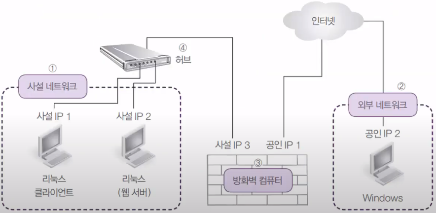

## 18-01 방화벽 서버-방화벽 개념과 실습환경 설명

### 보안을 위한 네트워크 설계

- 방화벽이란
  - 외부의 공개된 네트워크와 내부의 사설 네트워크 사이에 자리잡고 외부와 내부에 전달되는 트래픽을 정책에 의해 허용/거부하는 역할
- 사설IP(Private IP)
  - 내부의 사용자는 외부의 인터넷을 이용, 외부에서는 내부로 침입할 수 없게 하는 방법 중 가장 보편적으로 많이 사용하는 방법, nonroutable IP 주소를 이용함
  - 사설IP의 주소 범위는 `10.0.0.0 ~ 10.255.255.255`, `172.16.0.0 ~ 172.31.255.255`, `192.168.0.0 ~ 192.168.255.255` 세 범위가 있음
  - `IP 마스커레이딩(Masquerading)`: 사설IP 주소의 컴퓨터가 외부의 인터넷으로 접속할 수 있도록 해 주는 방법

### 보편적인 회사 네트워크 구성

### 보안 네트워크 실습 설계

## 18-02 방화벽 서버-방화벽 구현

### [실습1] 방화벽 컴퓨터 구현

실습목표
- 3대의 컴퓨터를 이용, 방화벽 구성
- 실제 네트워크 구성에 대한 이해의 폭을 넓힘
- iptables 유틸리티의 활용법을 이해

